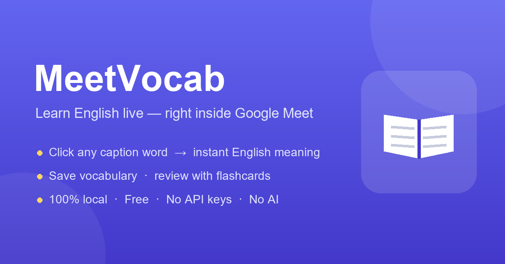
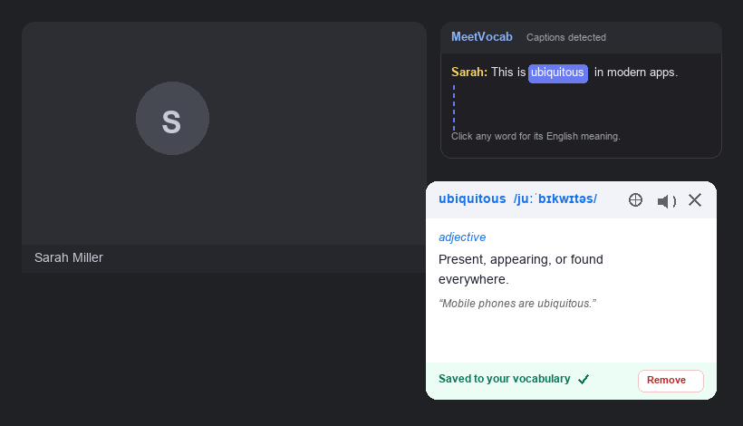
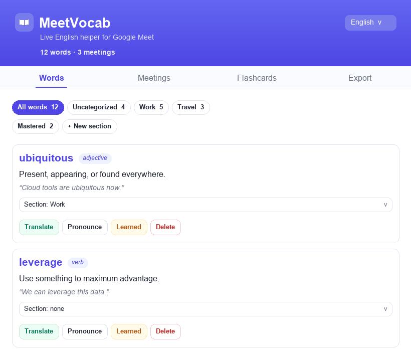
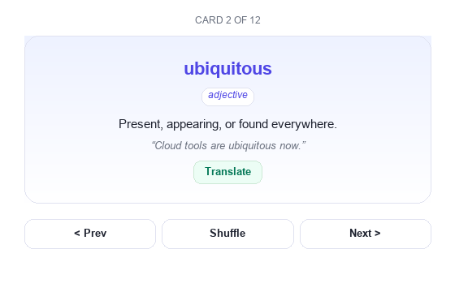

# MeetVocab — Live English Helper for Google Meet




A free, fully‑local Chrome extension (Manifest V3) that turns **Google Meet captions** into an English‑learning tool. Click any word in the live captions to see its English definition, hear it pronounced, save it to your vocabulary, and review everything later with flashcards — **no AI, no paid APIs, no API keys, nothing leaves your device** (except a single anonymous request to a free public dictionary).

---

## ✨ Features

- **📝 Live caption capture** — reads Google Meet's closed captions into a clean, draggable side panel.
- **👆 Click‑to‑learn** — every word is clickable; one click shows its English meaning, part of speech, and an example.
- **🔁 Recursive lookup** — don't understand a word *inside* a definition? Click it too.
- **🔊 Pronunciation** — native English Text‑to‑Speech (Web Speech API), no audio downloads.
- **🌍 Optional offline translation** — a built‑in offline dictionary translates a word to **Arabic** or **Turkish** on demand (no network).
- **🗂️ Organize** — sort saved words into custom **sections**, mark words as **mastered**, and browse by **meeting**.
- **🧠 Flashcards** — review your words with a 3D flip card.
- **📤 Export** — download your words grouped by meeting as Markdown or plain text.
- **🌐 Multilingual UI** — interface available in **English, العربية, Türkçe** (definitions always stay English).

## 📸 Screenshots

**During a meeting — click any caption word for an instant English definition, then save it:**



**Dashboard — organize your vocabulary into custom sections and browse it by meeting:**



**Review everything with flashcards:**



## 🧠 How it works


1. Join a Google Meet call and turn on captions (CC).
2. Click any word in the caption box to see its meaning — it's saved automatically.
3. Come back to the dashboard to organize, review as flashcards, or export.

```
Google Meet captions
        │  (content script reads the DOM, mirrors words into our own panel)
        ▼
  click a word ──► background service worker ──► api.dictionaryapi.dev (free, public)
        │                                              │
        ▼                                              ▼
 chrome.storage.local  ◄────────  normalized definition + example
        │
        ▼
 popup dashboard (words · meetings · flashcards · export)
```

The dictionary fetch runs in the **background service worker** (not the page) so it isn't blocked by Google Meet's strict Content‑Security‑Policy. Captions are never injected back into Meet's DOM — the extension mirrors them into its own panel, which keeps working even when Meet rewrites its caption markup.

## 🔒 Privacy

- All vocabulary, meetings and settings are stored **locally** in `chrome.storage.local`.
- **No accounts, no tracking, no analytics.**
- The only network request is the word you click, sent to the free, public, key‑less [Free Dictionary API](https://dictionaryapi.dev/) to fetch its definition. No personal data is collected or transmitted.

## 📦 Installation (Load unpacked)

1. Download or clone this repository.
2. Open Chrome and go to `chrome://extensions`.
3. Turn on **Developer mode** (top‑right).
4. Click **Load unpacked** and select the project folder (the one containing `manifest.json`).
5. Open Google Meet, enable captions (CC), and start clicking words. 🎉

> Keep the folder somewhere permanent — Chrome loads the extension directly from it.

## 🧰 Tech stack

- **Chrome Extension Manifest V3** (content script + background service worker + popup)
- **Vanilla JavaScript** (no frameworks, no build step), HTML & CSS
- `MutationObserver` for caption tracking · `chrome.storage.local` for persistence
- [Free Dictionary API](https://dictionaryapi.dev/) for definitions
- **Web Speech API** (`speechSynthesis`) for pronunciation
- A small bundled **offline dictionary** for optional AR/TR word translation

## 🗂️ Project structure

```
manifest.json            Extension manifest (MV3)
background/
  service_worker.js      Dictionary lookups (the only place that hits the network)
content/
  content.js             Reads Meet captions, builds the clickable panel + popup
  content.css            Panel & popup styles
lib/
  store.js               chrome.storage.local wrapper (vocab, meetings, categories)
  i18n.js                UI translations (en / ar / tr)
  dictionary.js          Built‑in offline EN→AR/TR word dictionary
popup/
  popup.html             Dashboard markup + styles
  popup.js               Dashboard logic (words, meetings, flashcards, export)
icons/                   Extension icons (16 / 32 / 48 / 128)
```

## 📜 License

[MIT](LICENSE) © 2026 Mohamad Khoja

---

## Türkçe

**MeetVocab**, Google Meet görüşmeleri sırasında İngilizce öğrenenlere yardımcı olan ücretsiz bir Chrome uzantısıdır. Canlı altyazıdaki (CC) herhangi bir kelimeye tıklayınca **İngilizce anlamı** telaffuzuyla birlikte görünür ve kelime otomatik olarak kaydedilir; daha sonra kartlarla tekrar edebilirsiniz.

- **%100 yerel** — tüm verileriniz cihazınızda kalır, hesap ve takip yok.
- **Yapay zekâ yok, API anahtarı yok, hiçbir ücret yok.**
- Kelimeleri **bölümlere** ayır, **öğrenildi** olarak işaretle, **toplantıya** göre gözat.
- İsteğe bağlı **çevrimdışı çeviri** (Arapça / Türkçe).
- Üç dilli arayüz: İngilizce, Arapça, Türkçe (tanımlar İngilizce kalır).

**Kurulum:** `chrome://extensions` → **Geliştirici modu**'nu açın → **Paketlenmemiş öğe yükle** ile proje klasörünü seçin.

---

<div dir="rtl">

## العربية

**MeetVocab** إضافة مجانية لمتصفّح Chrome تساعد متعلّمي الإنجليزية أثناء اجتماعات Google Meet. تنقر أي كلمة في الترجمة المباشرة (CC) فيظهر **معناها بالإنجليزية**، مع نطقها، وتُحفظ تلقائيًا في مفرداتك لمراجعتها لاحقًا بالبطاقات.

- **محلية 100%** — كل بياناتك تبقى على جهازك، بلا حسابات ولا تتبّع.
- **بدون ذكاء اصطناعي وبدون مفاتيح API وبدون أي تكلفة.**
- تنظيم الكلمات في **أقسام**، وتمييز الكلمات **المُتقَنة**، وتصفّح حسب **الاجتماع**.
- ترجمة اختيارية للكلمة إلى **العربية/التركية** من قاموس مدمج (بدون إنترنت).
- واجهة بثلاث لغات: الإنجليزية، العربية، التركية (التعريفات تبقى إنجليزية).

**التثبيت:** افتح `chrome://extensions` ← فعّل **وضع المطوّر** ← اضغط **Load unpacked** واختر مجلد المشروع.

</div>
